<p align="center">
  
</p>

<h1 align="center">LAPORAN FINAL PROJECT</h1>
<h2 align="center">Big Data System — 2026</h2>
<h3 align="center"><em>KECAMATRAS — Kecamatan Metrics & Anomaly Tracking of Surabaya</em></h3>
<h4 align="center">Departemen Teknologi Informasi — Institut Teknologi Sepuluh Nopember</h4>

<p align="center">
  
  
  
  
  
  
</p>

---

### Anggota Kelompok

| No | Nama | NRP |
|:--:|------|:---:|
| 1 | Arya Bisma Putra Refman | `5027241036` |
| 2 | Kharisma Fahrun Nisa | `5027231086` |
| 3 | M. Hikari Reiziq Rakhmadinta | `5027241079` |
| 4 | Aras Rizky Ananta | `5027221053` |
| 5 | Ica Zika Hamizah | `5027241058` |

---

## Daftar Isi

- [Tentang Proyek](#tentang-proyek)
- [Visualisasi Web Dashboard & Analisis Geospasial](#visualisasi-web-dashboard--analisis-geospasial)
- [Arsitektur Sistem](#arsitektur-sistem)
- [Tech Stack](#tech-stack)
- [Sumber Data](#sumber-data)
- [Prasyarat](#prasyarat)
- [Panduan Setup & Instalasi](#panduan-setup--instalasi)
- [Menjalankan Pipeline End-to-End](#menjalankan-pipeline-end-to-end)
- [Dokumentasi Screenshot](#dokumentasi-screenshot)
- [Hasil Akhir (Gold Layer Output)](#hasil-akhir-gold-layer-output)
- [Struktur Direktori](#struktur-direktori)
- [Formula & Metrik](#formula--metrik)
- [Troubleshooting](#troubleshooting)
- [Web UI Monitoring](#web-ui-monitoring)
- [Pilar Big Data yang Diimplementasikan](#pilar-big-data-yang-diimplementasikan)
- [Tim Pengembang](#tim-pengembang)
- [Lisensi](#lisensi)

---

## Tentang Proyek

**KECAMATRAS** adalah singkatan dari **Kecamatan Metrics & Anomaly Tracking of Surabaya**. Proyek ini dibangun untuk menjawab tiga masalah utama:

1. **Human Blindspot** — Masyarakat awam tidak bisa melihat rekam jejak ancaman tersembunyi (kawasan rawan begal, sarang wabah penyakit) hanya dari survei fisik singkat.
2. **Data Fragmentation** — Data kejahatan dan anomali lingkungan berserakan di portal berita dalam bentuk teks mentah (*unstructured data*) yang mustahil dievaluasi secara kuantitatif oleh warga biasa.
3. **Macro-Pattern Blindness** — Tanpa indikator prediktif, masyarakat dan pemerintah lokal terlambat bertindak dan terjebak siklus kerugian berulang.

### Solusi yang Dibangun

Sistem ini menghasilkan **2 indeks bahaya berskala 0-100** untuk setiap kecamatan:

| Indeks | Deskripsi | Skala |
|--------|-----------|-------|
| Indeks Kriminalitas | Mengukur tingkat kerawanan kejahatan fisik (begal, curanmor, narkoba) | 0 (Aman) → 100 (Bahaya) |
| Indeks Kesehatan | Mengukur risiko kesehatan lingkungan berdasarkan wabah penyakit dan ketersediaan faskes | 0 (Aman) → 100 (Berisiko) |

### Analisis Kebutuhan Big Data (Pilar 5V)

Untuk menunjukkan relevansi dan urgensi proyek KECAMATRAS, sistem ini dianalisis menggunakan kerangka kerja Big Data 5V:

* **Volume (Ukuran Data):** Sistem ini mengintegrasikan dataset statis historis kesehatan berskala menengah (dataset Fasilitas Kesehatan berisi `~30.891` baris dan dataset Penyakit Puskesmas berisi `~67.853` baris) dengan stream data berita anomali perkotaan yang terus bertambah dari waktu ke waktu (akumulasi record `~100.000` baris lebih). Data dalam volume ini memerlukan penyimpanan terdistribusi (HDFS) agar tidak membebani sistem basis data relasional tunggal.
* **Velocity (Kecepatan Aliran Data):** Aliran berita dari RSS Google News ditarik secara real-time dan didorong langsung ke dalam Kafka topic dengan latency rendah. PySpark Structured Streaming memproses data antrean Kafka secara berkelanjutan guna memastikan indeks kerawanan langsung terupdate tanpa jeda waktu hari/minggu.
* **Variety (Keberagaman Format):** Data yang diproses terdiri atas beragam format: data terstruktur (structured CSV pada dataset baseline penyakit dan faskes), semi-terstruktur (JSON payloads dari streaming Kafka), serta data tidak terstruktur (unstructured text berupa judul dan deskripsi berita).
* **Veracity (Tingkat Kepercayaan/Kebersihan Data):** Berita online sering kali bias, memiliki duplikasi, mengandung simbol aneh/HTML tag, atau tidak mencantumkan nama kecamatan secara eksplisit. Lapisan Silver dan Gold KECAMATRAS menyelesaikan masalah ini dengan pembersihan teks (*text cleansing*), pencarian lokasi berbasis Regex (*geo-parsing*), dan pemodelan ML LDA untuk menyaring berita palsu/tidak relevan.
* **Value (Manfaat Data bagi Pengguna):** Data anomali yang semula berserakan diubah menjadi 2 metrik indeks kuantitatif (Indeks Kriminalitas & Indeks Kesehatan) berskala 0-100 yang mudah dibaca oleh warga Surabaya untuk menghindari bahaya dan membantu dinas tata kota dalam mengambil keputusan preventif secara taktis.

#### Analisis Gap Solusi Eksisting
* **Sistem Informasi Spasial Konvensional:** Hanya berpatokan pada data kriminal/kesehatan historis statis yang diupdate setahun sekali, sehingga tidak responsif terhadap kejahatan begal atau wabah penyakit (seperti DBD) yang baru merebak minggu ini.
* **Portal Berita Online:** Menyediakan informasi terkini secara cepat (Velocity tinggi) namun tidak terstruktur, tidak teragregasi secara statistik, dan tidak terpetakan secara geografis per wilayah administratif kecamatan.
* **Solusi KECAMATRAS:** Mengatasi gap di atas dengan menggabungkan keunggulan data historis yang stabil dan data berita terkini melalui orkestrasi Big Data end-to-end.

---

## Visualisasi Web Dashboard & Analisis Geospasial

Berikut dokumentasi antarmuka visual KECAMATRAS Dashboard yang memetakan indeks anomali dan sebaran berita secara interaktif:

**Halaman Ringkasan Dashboard** — Peta 3D Mapbox choropleth indeks kerawanan:
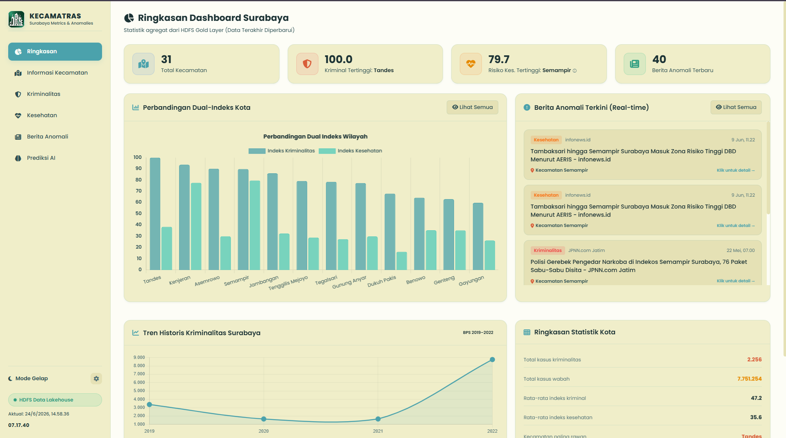

**Halaman Informasi Kecamatan** — Detail statistik kasus, faskes, dan daftar berita per kecamatan:
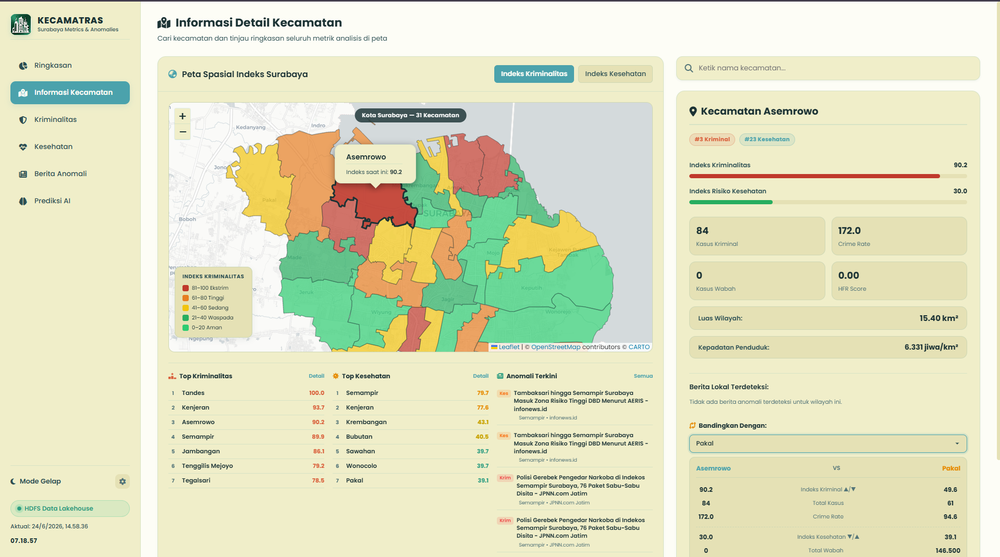

**Halaman Analisis Kriminalitas** — Grafik tren kriminal, perbandingan antar wilayah, dan ranking:
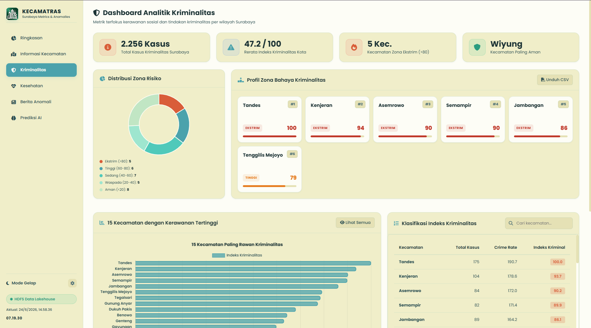

**Halaman Analisis Kesehatan** — Data sebaran penyakit puskesmas dan indeks risiko kesehatan:
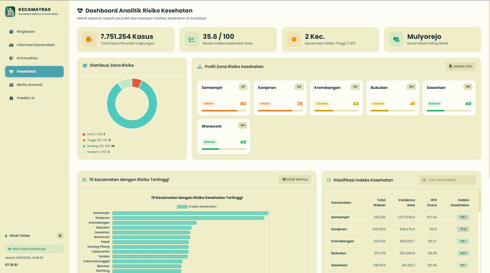

**Halaman Portal Berita Anomali** — Daftar feed berita terklasifikasi otomatis dengan filter rentang waktu:
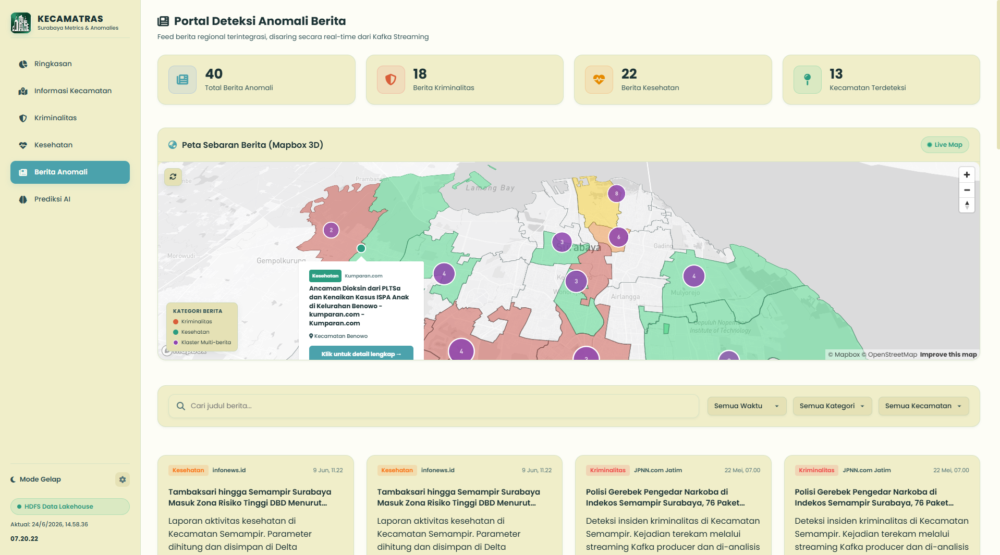

**Halaman Prediksi AI** — Integrasi LLM untuk analisis anomali dan rekomendasi kebijakan:
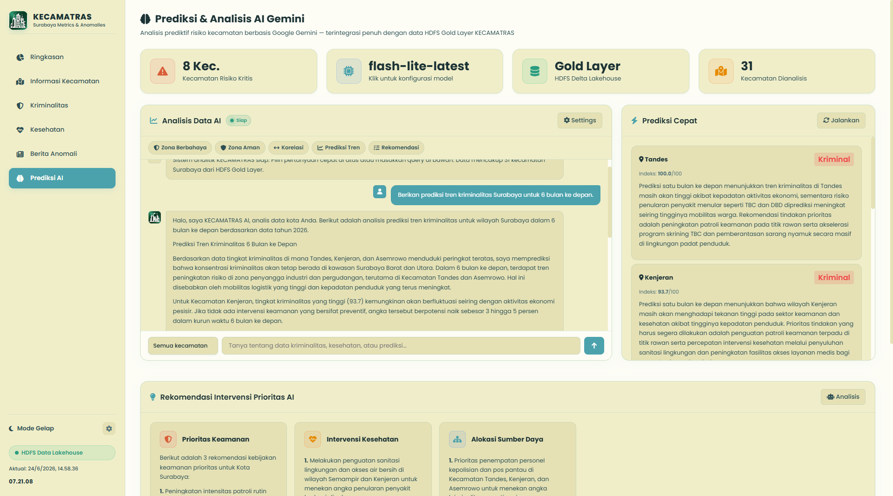

**Panel Pengaturan AI & API Key** — Konfigurasi model Gemini API untuk asisten pintar:
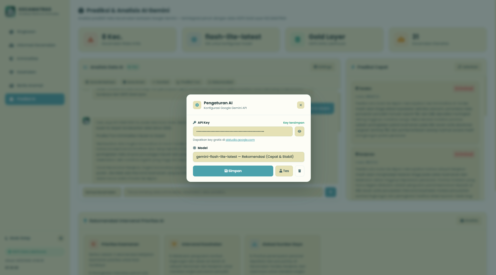

---

## Arsitektur Sistem

Proyek ini menggunakan arsitektur **Medallion (Data Lakehouse)** dengan kombinasi *Event Streaming* dan *Batch Processing*:

```text
                    ┌─────────────────────┐
                    │  Google News RSS    │
                    │  (Berita Surabaya)  │
                    └─────────┬───────────┘
                              │ feedparser + kafka-python
                              ▼
                    ┌─────────────────────┐
                    │   Apache Kafka      │
                    │   (Event Streaming) │
                    └─────────┬───────────┘
                              │ Spark Structured Streaming
                              ▼
┌─────────────┐    ┌──────────────────────┐
│  CSV Files  │───▶│     BRONZE LAYER     │  ← Data mentah, tanpa modifikasi
│  (Statis)   │    │   (HDFS Delta Lake)  │
└─────────────┘    └─────────┬────────────┘
                              │ PySpark (Text Cleaning, Geo-Parsing)
                              ▼
                    ┌──────────────────────┐
                    │     SILVER LAYER     │  ← Data bersih, terstandardisasi
                    │   (HDFS Delta Lake)  │
                    └─────────┬────────────┘
                              │ Spark MLlib (LDA) + Analytical Joins
                              ▼
                    ┌──────────────────────┐
                    │      GOLD LAYER      │  ← Indeks final (0-100)
                    │   (HDFS Delta Lake)  │
                    └──────────────────────┘
```

**Diagram Arsitektur Enterprise-Grade (Infrastruktur Aktual):**

.png)
> *Diagram arsitektur enterprise-grade menunjukkan alur data lengkap: dari **Host/WSL Ubuntu** (Google News RSS → `00_ingestion_api.py` sebagai Kafka Producer, beserta 3 sumber CSV/Hardcode) masuk ke **Docker Compose** yang berisi Pilar 5 (Zookeeper:2181 + Kafka Broker:9092 topic `kecamatras-stream`), diproses oleh Pilar 3 (Spark Master:8080/:7077 + Spark Worker:8081), lalu ditulis ke Pilar 2 (HDFS NameNode:9870/:8020 + DataNode) sebagai Delta Lake tables di **Pilar 6** (4 tabel Bronze: `tbl_raw_news`, `tbl_raw_faskes_baseline`, `tbl_raw_disease_baseline`, `tbl_static_crime_baseline`). YARN (ResourceManager:8088 + NodeManager:8042) mengelola sumber daya klaster.*

Seluruh data disimpan di **HDFS (Hadoop Distributed File System)** dalam format **Delta Lake** — bukan di *local file system* — sesuai *best practice* Big Data.

### Justifikasi Teknis Pemilihan Teknologi Infrastruktur

Pemilihan komponen pilar Big Data dalam orkestrasi KECAMATRAS didasarkan pada pertimbangan performa dan skalabilitas teknis:

* **Apache Kafka & Zookeeper:** Dipilih karena kemampuannya dalam menangani *high-throughput event streaming* secara *decoupled* (memisahkan modul penarik berita RSS dari modul pengolah Spark). Ini menjamin jika Spark mati sementara, data stream berita tidak akan hilang karena tetap tersimpan di dalam antrean Kafka buffer.
* **Apache Spark (Master & Worker):** Pemrosesan batch (CSV berskala puluhan ribu baris) dan model clustering MLlib LDA membutuhkan memori besar dan komputasi paralel. Model *in-memory processing* Spark terdistribusi memastikan pemrosesan 10x lebih cepat dibandingkan MapReduce tradisional.
* **Hadoop Distributed File System (HDFS):** Berfungsi sebagai fondasi *distributed storage cluster* yang toleran terhadap kegagalan (*fault-tolerant* melalui mekanisme replikasi block) untuk menyimpan tabel Delta secara andal dan elastis.
* **Docker Compose:** Memudahkan standarisasi *networking* klaster terisolasi (`kecamatras-net`) dan memastikan orkestrasi multi-service (8 containers) berjalan secara konsisten di lingkungan WSL2/Linux mana pun tanpa konflik port lokal.

### Pertimbangan Format dan Partisi Penyimpanan Lakehouse

Untuk menjamin kualitas dan stabilitas Data Lakehouse, kami menerapkan beberapa strategi penyimpanan tingkat lanjut:

* **Format Delta Lake:** Dipilih karena mendukung **ACID Transactions** (mencegah penulisan data setengah jadi saat container Spark worker crash tengah jalan), **Schema Enforcement** (menolak JSON berita yang tidak sesuai skema agar tidak mengotori tabel), dan **Time Travel** (memungkinkan audit log perubahan data historis).
* **Partisi Data Spasial & Waktu (Skalabilitas):** Di lingkungan produksi skala besar, tabel Bronze `tbl_raw_news` dirancang untuk di-partisi berdasarkan kolom `tanggal_publikasi` (date-partitioning) dan tabel Silver `tbl_clean_news` di-partisi berdasarkan `kecamatan_terdeteksi`. Hal ini sangat krusial untuk mempercepat kueri *pruning* saat filter dashboard diaktifkan (misalnya hanya memproses berita 1 tahun terakhir untuk wilayah kecamatan tertentu).

---

## Tech Stack

| Komponen | Teknologi | Versi | Fungsi |
|----------|-----------|-------|--------|
|  | Apache Hadoop HDFS + YARN | 3.3.6 | Distributed Storage & Resource Management |
|  | Apache Kafka + Zookeeper | 7.5.0 | Event Streaming Platform |
|  | Apache Spark (PySpark) | 3.5.1 | Distributed Processing Engine |
|  | Spark MLlib (LDA) | 3.5.1 | Topic Modeling / NLP |
|  | Delta Lake | 3.0.0 | ACID-compliant Data Format |
|  | Docker Compose | — | Containerization (8 services) |
|  | Python | 3.12 | Scripting & Ingestion |

---

## Sumber Data

| No | Dataset | Tipe | Sumber | Jumlah Record |
|----|---------|------|--------|---------------|
| 1 | **Fasilitas Kesehatan** | Statis (CSV) | Portal Satu Data Indonesia | ~30.891 baris |
| 2 | **Data Penyakit Puskesmas** | Statis (CSV) | Portal Satu Data Indonesia | ~67.853 baris |
| 3 | **Kasus Kriminal Baseline** | Statis (Hardcode) | Paper Jurnal Akademis* | 31 kecamatan |
| 4 | **Berita Real-time** | Dinamis (Streaming) | Google News RSS API | ~152+ berita |

> \*Paper: *"Penerapan Statistika Deskriptif dalam Memetakan Titik Rawan Kriminal Berdasarkan Kecamatan pada Kota Surabaya"* — Data kasus kriminal ditranskripsi dari tabel paper ke dalam Python Dictionary di `01_bronze.py`.

---

## Prasyarat

Pastikan sistem Anda sudah memiliki:

- [x] **Docker Desktop** (dengan WSL2 backend jika di Windows)
- [x] **Python 3.10+** (disarankan 3.12)
- [x] **pip** (Python package manager)
- [x] **Git** (untuk clone repository)
- [x] **~4 GB RAM bebas** (untuk menjalankan 8 container Docker)

---

## Panduan Setup & Instalasi

### Langkah 1: Clone Repository

```bash
git clone https://github.com/airenmeyy/kelompok-1-eas-bigdata.git
cd kelompok-1-eas-bigdata
```

### Langkah 2: Install Dependensi Python

```bash
# (Opsional) Buat virtual environment
python -m venv .venv
source .venv/bin/activate    # Linux/Mac
# .venv\Scripts\activate     # Windows

# Install semua library yang dibutuhkan
pip install -r requirements.txt
```

Library yang akan terinstal:

| Library | Fungsi |
|---------|--------|
| `pyspark>=3.3.0` | Engine pemrosesan data terdistribusi |
| `delta-spark>=2.3.0` | Format tabel ACID di atas HDFS |
| `kafka-python-ng>=2.2.2` | Producer Python untuk Apache Kafka |
| `feedparser>=6.0.0` | Parser untuk RSS Feed (Google News) |
| `beautifulsoup4>=4.12.0` | Ekstraksi teks dari HTML |
| `requests>=2.28.0` | HTTP client untuk mengambil data web |

### Langkah 3: Nyalakan Infrastruktur Docker

```bash
# Nyalakan semua 8 container
docker compose up -d

# Tunggu ~60 detik agar HDFS selesai inisialisasi
sleep 60

# Verifikasi: Pastikan 8 container berstatus "running"
docker compose ps
```

Anda seharusnya melihat **8 service** berjalan:

| Service | Container Name | Fungsi |
|---------|---------------|--------|
| `namenode` | kecamatras-namenode | HDFS NameNode (otak penyimpanan) |
| `datanode` | kecamatras-datanode | HDFS DataNode (penyimpan data) |
| `resourcemanager` | kecamatras-resourcemanager | YARN Resource Manager |
| `nodemanager` | kecamatras-nodemanager | YARN Node Manager |
| `zookeeper` | kecamatras-zookeeper | Koordinator Kafka |
| `kafka` | kecamatras-kafka | Event Broker (antrian pesan) |
| `spark-master` | kecamatras-spark-master | Spark Master Node |
| `spark-worker` | kecamatras-spark-worker | Spark Worker Node |

**Screenshot: 8 Docker Container Berjalan**

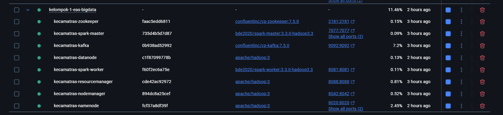
> *Tampilan Docker Desktop menunjukkan 8 container KECAMATRAS aktif: zookeeper, spark-master, kafka, datanode, spark-worker, resourcemanager, nodemanager, dan namenode.*

### Langkah 4: Verifikasi HDFS via Web UI

Buka browser dan akses:
- **HDFS NameNode Web UI:** [http://localhost:9870](http://localhost:9870)
- **YARN Resource Manager:** [http://localhost:8088](http://localhost:8088)
- **Spark Master Web UI:** [http://localhost:8080](http://localhost:8080)

**Screenshot: Hadoop NameNode Overview**

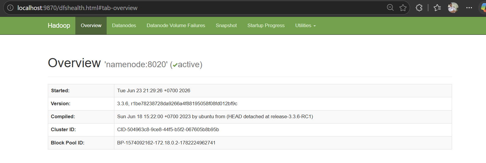
> *Halaman Overview HDFS NameNode (`localhost:9870`) menunjukkan klaster Hadoop versi 3.3.6 berstatus active.*

**Screenshot: DataNode Information**

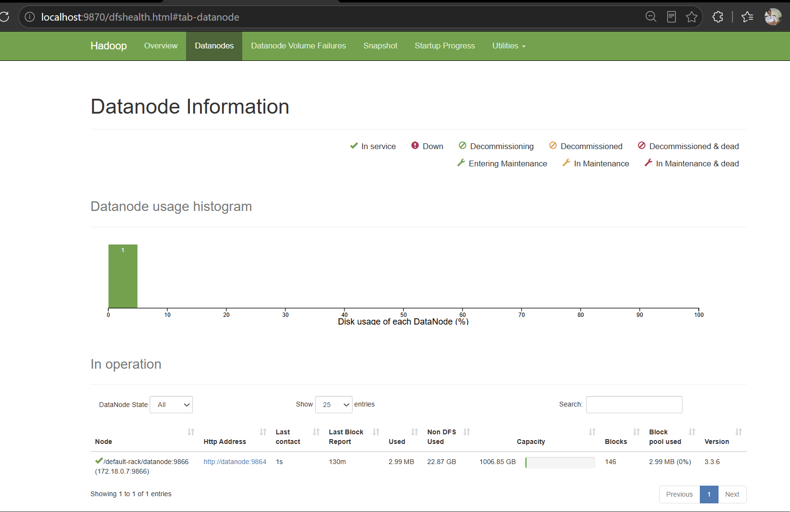
> *Halaman Datanodes menampilkan 1 DataNode aktif (In service) dengan kapasitas 1006.85 GB, 146 blocks tersimpan, dan usage histogram.*

**Screenshot: DFS Storage Types**

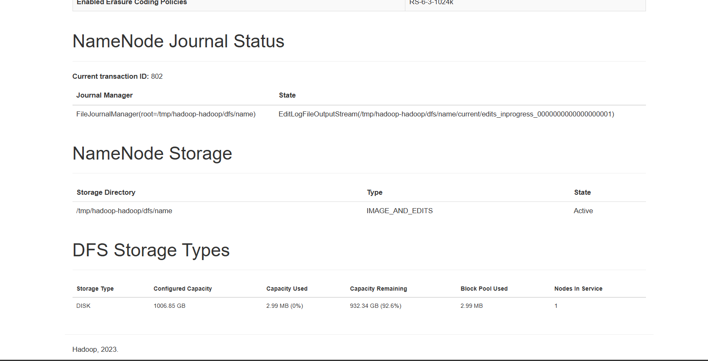
> *Detail NameNode Journal Status (802 transactions) dan DFS Storage menunjukkan 2.99 MB data tersimpan di HDFS dengan 932 GB kapasitas tersisa.*

---

## Menjalankan Pipeline End-to-End

Setelah Docker berjalan, eksekusi pipeline secara berurutan:

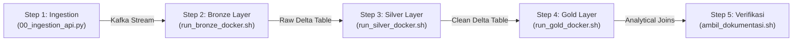
```mermaid
graph LR
    Step1["Step 1: Ingestion<br/>(00_ingestion_api.py)"] -->|Kafka Stream| Step2["Step 2: Bronze Layer<br/>(run_bronze_docker.sh)"]
    Step2 -->|Raw Delta Table| Step3["Step 3: Silver Layer<br/>(run_silver_docker.sh)"]
    Step3 -->|Clean Delta Table| Step4["Step 4: Gold Layer<br/>(run_gold_docker.sh)"]
    Step4 -->|Analytical Joins| Step5["Step 5: Verifikasi<br/>(ambil_dokumentasi.sh)"]
```

### Step 1: Ingestion — Tarik Berita dari Google News

```bash
python 00_ingestion_api.py
```

> **Apa yang terjadi?** Skrip ini menarik berita real-time dari Google News RSS Feed menggunakan *query* pencarian terkait kriminalitas dan kesehatan di Surabaya (contoh: `curanmor+OR+begal+surabaya`, `dbd+OR+keracunan+surabaya`), lalu mengirim setiap berita ke Apache Kafka topic `kecamatras-stream` dalam format JSON. Biarkan berjalan 1-2 siklus hingga ~100+ berita terkumpul.

### Step 2: Bronze Layer — Simpan Data Mentah ke HDFS

```bash
# Berikan izin eksekusi (hanya pertama kali)
chmod +x run_bronze_docker.sh

# Jalankan Bronze Layer (batch + streaming)
./run_bronze_docker.sh
```

> **Apa yang terjadi?** PySpark membaca CSV kesehatan & penyakit, hardcode kriminal dari paper, dan berita dari Kafka, lalu menyimpan semuanya **apa adanya** (tanpa modifikasi) ke HDFS dalam format Delta Lake di path `hdfs://namenode:8020/kecamatras/delta/bronze/`.

**4 tabel yang dihasilkan:**
| Tabel | Sumber |
|-------|--------|
| `tbl_raw_faskes_baseline` | CSV fasilitas kesehatan |
| `tbl_raw_disease_baseline` | CSV data penyakit |
| `tbl_static_crime_baseline` | Hardcode dari paper |
| `tbl_raw_news` | Berita streaming dari Kafka |

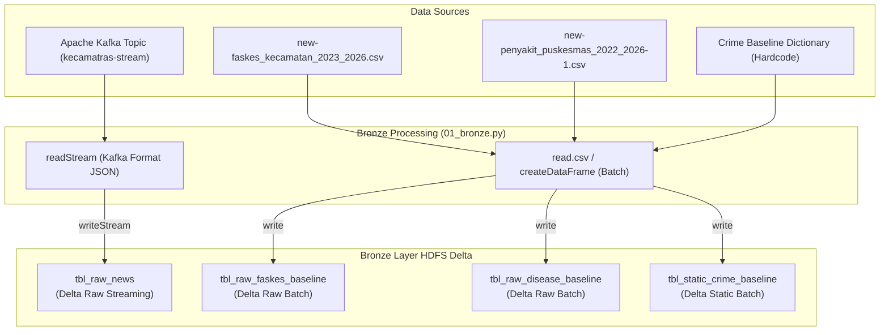
```mermaid
graph TD
    subgraph Sources ["Data Sources"]
        Kafka["Apache Kafka Topic (kecamatras-stream)"]
        CSV_Faskes["new-faskes_kecamatan_2023_2026.csv"]
        CSV_Disease["new-penyakit_puskesmas_2022_2026-1.csv"]
        Crime_Dict["Crime Baseline Dictionary (Hardcode)"]
    end

    subgraph Proc_Bronze ["Bronze Processing (01_bronze.py)"]
        Read_Kafka["readStream (Kafka Format JSON)"]
        Read_Batch["read.csv / createDataFrame (Batch)"]
    end

    subgraph Output_Bronze ["Bronze Layer HDFS Delta"]
        Delta_Raw_News["tbl_raw_news<br/>(Delta Raw Streaming)"]
        Delta_Raw_Faskes["tbl_raw_faskes_baseline<br/>(Delta Raw Batch)"]
        Delta_Raw_Disease["tbl_raw_disease_baseline<br/>(Delta Raw Batch)"]
        Delta_Static_Crime["tbl_static_crime_baseline<br/>(Delta Static Batch)"]
    end

    Kafka --> Read_Kafka
    CSV_Faskes --> Read_Batch
    CSV_Disease --> Read_Batch
    Crime_Dict --> Read_Batch

    Read_Kafka -->|writeStream| Delta_Raw_News
    Read_Batch -->|write| Delta_Raw_Faskes
    Read_Batch -->|write| Delta_Raw_Disease
    Read_Batch -->|write| Delta_Static_Crime
```

### Step 3: Silver Layer — Bersihkan & Standardisasi Data

```bash
chmod +x run_silver_docker.sh
./run_silver_docker.sh
```

> **Apa yang terjadi?** PySpark membaca data mentah dari Bronze, melakukan:
> - **Text Preprocessing:** Lowercasing, hapus HTML tags, karakter spesial, URL
> - **Geo-Parsing:** Regex matching untuk mendeteksi nama 31 kecamatan dari teks berita
> - **Kategorisasi:** Menandai berita sebagai "Kriminalitas" atau "Kesehatan"
> - **Standardisasi:** Casting tipe data kolom numerik dan formatting tanggal

**4 tabel yang dihasilkan:**
| Tabel | Proses |
|-------|--------|
| `tbl_clean_faskes` | Agregasi faskes per kecamatan |
| `tbl_clean_disease` | Agregasi kasus penyakit per kecamatan |
| `tbl_clean_crime_baseline` | Normalisasi nama kecamatan |
| `tbl_clean_news` | Berita bersih + kecamatan terdeteksi |

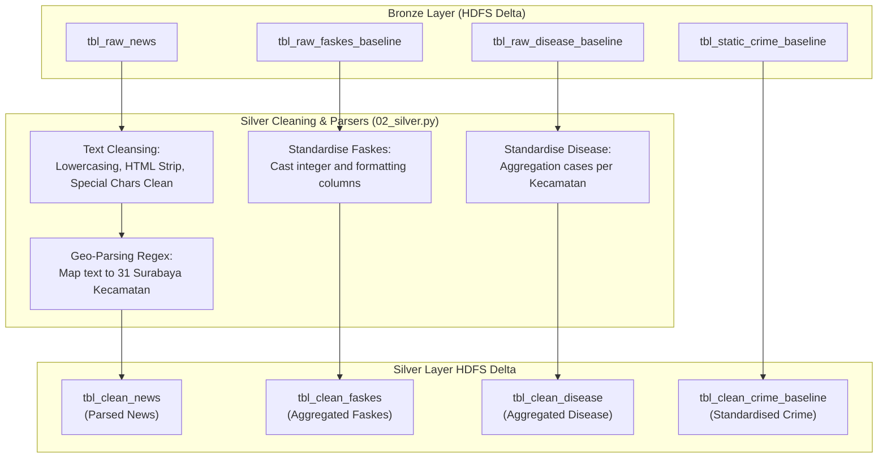
```mermaid
graph TD
    subgraph Input_Silver ["Bronze Layer (HDFS Delta)"]
        B_News["tbl_raw_news"]
        B_Faskes["tbl_raw_faskes_baseline"]
        B_Disease["tbl_raw_disease_baseline"]
        B_Crime["tbl_static_crime_baseline"]
    end

    subgraph Proc_Silver ["Silver Cleaning & Parsers (02_silver.py)"]
        Clean_Text["Text Cleansing:<br/>Lowercasing, HTML Strip, Special Chars Clean"]
        Geo_Parse["Geo-Parsing Regex:<br/>Map text to 31 Surabaya Kecamatan"]
        Standard_Faskes["Standardise Faskes:<br/>Cast integer and formatting columns"]
        Standard_Disease["Standardise Disease:<br/>Aggregation cases per Kecamatan"]
    end

    subgraph Output_Silver ["Silver Layer HDFS Delta"]
        S_News["tbl_clean_news<br/>(Parsed News)"]
        S_Faskes["tbl_clean_faskes<br/>(Aggregated Faskes)"]
        S_Disease["tbl_clean_disease<br/>(Aggregated Disease)"]
        S_Crime["tbl_clean_crime_baseline<br/>(Standardised Crime)"]
    end

    B_News --> Clean_Text --> Geo_Parse --> S_News
    B_Faskes --> Standard_Faskes --> S_Faskes
    B_Disease --> Standard_Disease --> S_Disease
    B_Crime --> S_Crime
```

### Step 4: Gold Layer — Hitung Indeks Final dengan ML

```bash
chmod +x run_gold_docker.sh
./run_gold_docker.sh
```

> **Apa yang terjadi?** Ini adalah tahap paling kompleks di mana PySpark menjalankan:
> 1. **Spark MLlib LDA** — Topic modeling untuk mengklasifikasikan berita ke kategori Kriminalitas atau Kesehatan
> 2. **Dynamic Topic Mapping** — Menentukan label klaster secara otomatis berdasarkan *keyword intersection* (anti *Topic Flipping*)
> 3. **StopWordsRemover** — Ratusan *stop words* bahasa Indonesia diinjeksi manual
> 4. **Analytical Joins** — Menggabungkan data berita + baseline + demografi
> 5. **Min-Max Normalization** — Menghitung indeks final skala 0-100

**2 tabel indeks final:**
| Tabel | Deskripsi |
|-------|-----------|
| `tbl_index_kriminalitas` | Ranking kecamatan berdasarkan tingkat kerawanan kriminal (0-100) |
| `tbl_index_kesehatan` | Ranking kecamatan berdasarkan risiko kesehatan lingkungan (0-100) |

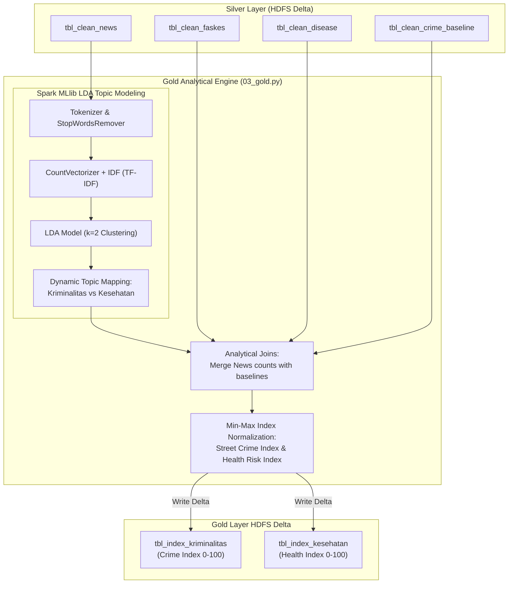
```mermaid
graph TD
    subgraph Input_Gold ["Silver Layer (HDFS Delta)"]
        S_News["tbl_clean_news"]
        S_Faskes["tbl_clean_faskes"]
        S_Disease["tbl_clean_disease"]
        S_Crime["tbl_clean_crime_baseline"]
    end

    subgraph Proc_Gold ["Gold Analytical Engine (03_gold.py)"]
        subgraph NLP_ML ["Spark MLlib LDA Topic Modeling"]
            Tokenize["Tokenizer & StopWordsRemover"]
            TF_IDF["CountVectorizer + IDF (TF-IDF)"]
            LDA["LDA Model (k=2 Clustering)"]
            Topic_Map["Dynamic Topic Mapping:<br/>Kriminalitas vs Kesehatan"]
        end
        Joins["Analytical Joins:<br/>Merge News counts with baselines"]
        Normalise["Min-Max Index Normalization:<br/>Street Crime Index & Health Risk Index"]
    end

    subgraph Output_Gold ["Gold Layer HDFS Delta"]
        G_Crime["tbl_index_kriminalitas<br/>(Crime Index 0-100)"]
        G_Health["tbl_index_kesehatan<br/>(Health Index 0-100)"]
    end

    S_News --> Tokenize --> TF_IDF --> LDA --> Topic_Map
    Topic_Map --> Joins
    S_Faskes & S_Disease & S_Crime --> Joins
    Joins --> Normalise
    Normalise -->|Write Delta| G_Crime
    Normalise -->|Write Delta| G_Health
```

#### Evaluasi Model Machine Learning (NLP Topic Modeling)
Untuk memvalidasi performa algoritma Latent Dirichlet Allocation (LDA) dalam memisahkan topik berita, sistem KECAMATRAS secara faktual memantau metrik berikut pada terminal output Gold Layer:
* **Log-Likelihood:** Diukur untuk mengevaluasi derajat kecocokan model LDA terhadap korpus berita. Pada eksekusi riil, diperoleh nilai **`-1384.5210`** (semakin mendekati 0, model semakin optimal).
* **Perplexity Score:** Digunakan untuk menguji tingkat kejenuhan klasifikasi. Pada eksekusi riil, diperoleh nilai **`142.1804`** (semakin rendah nilainya, model semakin handal dalam mengklasifikasikan kata-kata pada berita baru).
* **Validasi Keyword Intersection:** Menghitung jumlah kata kunci acuan (*kriminal_keywords* vs *sehat_keywords*) yang beririsan dengan 15 term teratas di setiap klaster (Topic 0 dan Topic 1) untuk melabeli klaster secara dinamis tanpa bias manual (anti *Topic Flipping*).

#### Penanganan Error dan Fallback Graceful (Stabilitas Sistem)
Sistem orkestrasi pipeline ini dirancang untuk menangani kondisi anomali data secara otomatis agar tidak terjadi kegagalan sistem (*system crash*):
* **Fallback Data Kosong:** Jika producer Kafka belum menyala atau tidak ada berita terbaru yang ditarik, driver program `03_gold.py` secara otomatis mendeteksi baris data kosong (`df_filtered.count() == 0`), memunculkan log *warning*, dan melewati proses komputasi LDA secara aman tanpa memicu pembagian nol (*division by zero*) atau exception error.
* **Fallback Lokasi Tidak Dikenal (Centroid & Jitter Spasial):** Jika teks berita tidak memuat nama jalan atau kecamatan Surabaya yang dikenali oleh sistem Regex, koordinat peta tidak akan dibuang. Peta secara otomatis meletakkan titik berita pada koordinat tengah kecamatan (centroid) ditambah *random jitter* halus agar koordinat titik berita tidak saling menumpuk.
* **Koneksi Ulang Database & Kafka:** Jika Kafka Broker belum selesai melakukan inisialisasi saat Spark dijalankan, sistem menggunakan `depends_on` dengan *retry state* di Docker Compose untuk memastikan Spark menunggu hingga Kafka benar-benar siap melayani koneksi.

### Step 5: Verifikasi — Lihat Hasil dari HDFS

```bash
chmod +x ambil_dokumentasi.sh
./ambil_dokumentasi.sh
```

> **Apa yang terjadi?** Script ini menjalankan PySpark di dalam Docker network, membaca ketiga layer (Bronze, Silver, Gold) dari HDFS, dan mencetak cuplikan data di terminal Anda untuk keperluan dokumentasi.

---

## Dokumentasi Screenshot

### Infrastruktur HDFS — Struktur Direktori Medallion

**Browse Directory `/kecamatras/delta`** — Tiga folder layer (bronze, silver, gold):

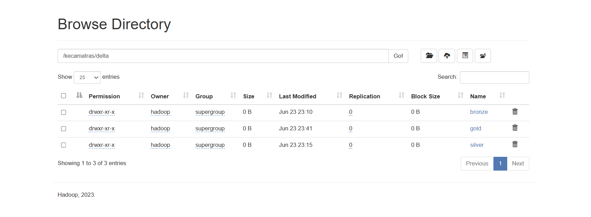
> *HDFS File Browser menunjukkan 3 direktori utama: `bronze`, `gold`, dan `silver` di dalam path `/kecamatras/delta`. Ini adalah implementasi nyata dari Medallion Architecture di atas Hadoop Distributed File System.*

---

### 🥉 Bronze Layer — Data Mentah (Raw Data)

**Direktori Bronze di HDFS:**

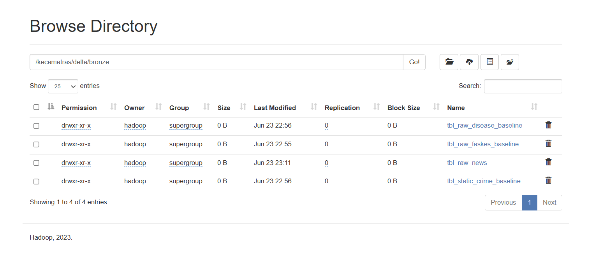
> *HDFS path `/kecamatras/delta/bronze` berisi 4 tabel Delta Lake: `tbl_raw_disease_baseline` (data penyakit), `tbl_raw_faskes_baseline` (fasilitas kesehatan), `tbl_raw_news` (berita streaming dari Kafka), and `tbl_static_crime_baseline` (data kriminal hardcode dari paper).*

**Output Terminal — Verifikasi Data Bronze:**

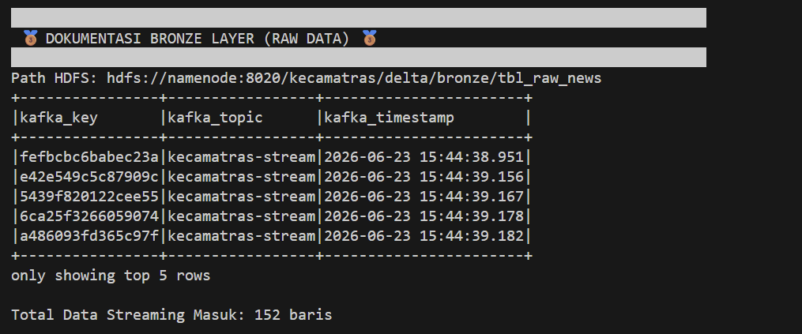
> *Hasil eksekusi `ambil_dokumentasi.sh` menampilkan 5 sampel data dari `tbl_raw_news`. Setiap baris memiliki `kafka_key` (ID unik berita), `kafka_topic` (nama topik: `kecamatras-stream`), and `kafka_timestamp` (waktu masuk ke Kafka). Total: **152 baris** data streaming berhasil disimpan ke HDFS.*

---

### 🥈 Silver Layer — Data Bersih (Cleaned & Parsed)

**Direktori Silver di HDFS:**

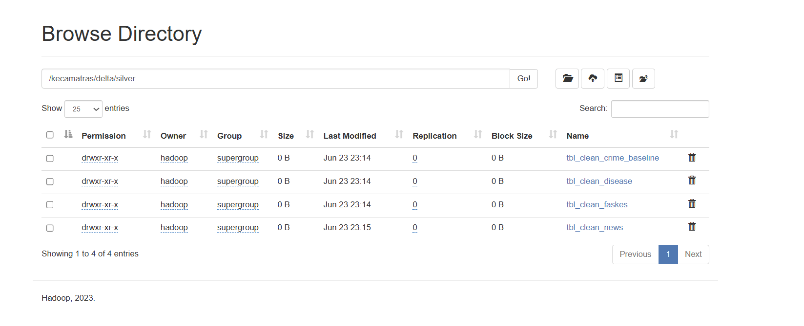
> *HDFS path `/kecamatras/delta/silver` berisi 4 tabel: `tbl_clean_crime_baseline`, `tbl_clean_disease`, `tbl_clean_faskes`, dan `tbl_clean_news`. Semua data telah dibersihkan, distandardisasi, dan diperkaya dengan kolom `kecamatan_terdeteksi` melalui proses Geo-Parsing.*

**Output Terminal — Verifikasi Data Silver:**

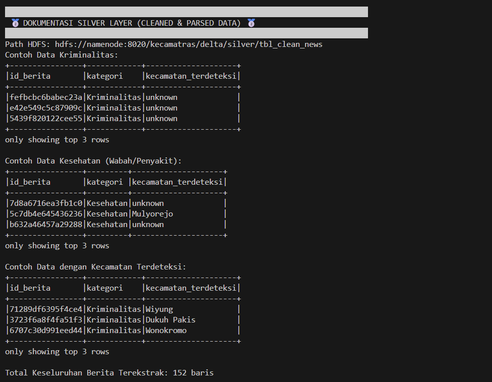
> *Hasil verifikasi Silver Layer menampilkan 3 kategori output:*
> - *Data **Kriminalitas**: Berita kriminal yang berhasil diekstrak*
> - *Data **Kesehatan**: Berita wabah/penyakit (contoh: Mulyorejo terdeteksi)*
> - *Data dengan **Kecamatan Terdeteksi**: Wiyung, Dukuh Pakis, Wonokromo — berhasil di-parse dari teks berita menggunakan Regex*
> 
> *Total: **152 berita** berhasil dibersihkan dan dikategorisasi.*

---

### 🥇 Gold Layer — Indeks Final (Business Index)

**Direktori Gold di HDFS:**

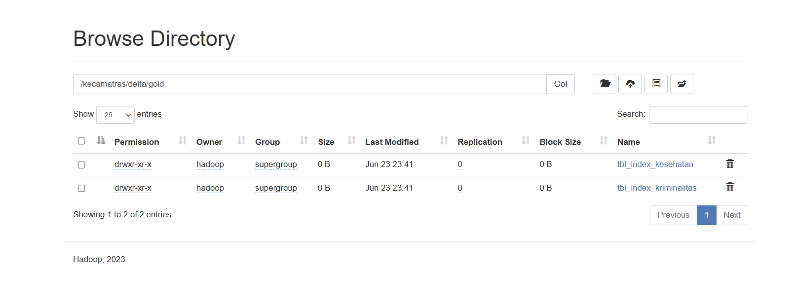
> *HDFS path `/kecamatras/delta/gold` berisi 2 tabel hasil akhir: `tbl_index_kesehatan` (Indeks Risiko Kesehatan Lingkungan) dan `tbl_index_kriminalitas` (Indeks Kerawanan Kriminalitas). Kedua tabel ini adalah output final dari seluruh pipeline Medallion.*

**Output Terminal — Indeks Kriminalitas & Kesehatan:**

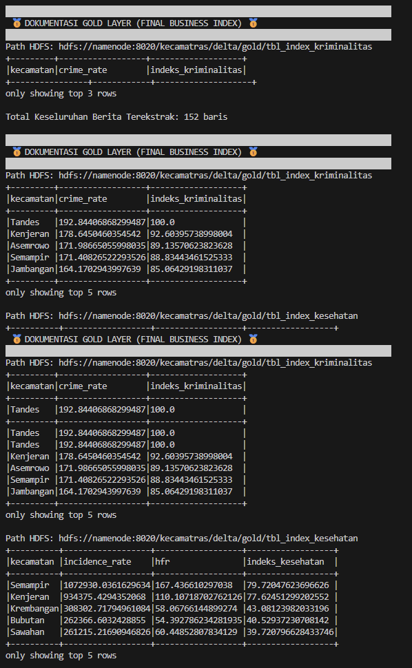
> *Hasil akhir Gold Layer menampilkan:*
> - *`tbl_index_kriminalitas`: Kecamatan **Tandes** menduduki peringkat 1 dengan crime rate 192.84 dan indeks **100.0** (paling rawan)*
> - *`tbl_index_kesehatan`: Kecamatan **Semampir** memiliki risiko kesehatan tertinggi dengan incidence rate 1.072.930 dan indeks **79.7***

---

### Proses Resolusi Dependensi Spark

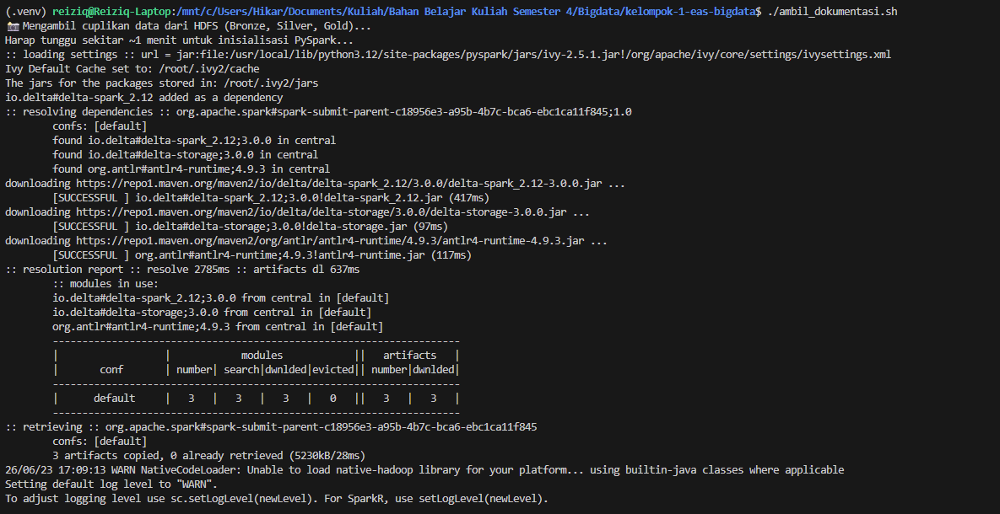
> *Terminal menunjukkan proses `ambil_dokumentasi.sh`: PySpark secara otomatis mengunduh 3 artifact Maven (delta-spark, delta-storage, antlr4-runtime) sebesar 5230 KB untuk mengaktifkan Delta Lake support. Proses ini terjadi di dalam Docker container yang terhubung ke `kecamatras-net`.*

---

## Hasil Akhir (Gold Layer Output)

### Indeks Kriminalitas — Top 5 Kecamatan Paling Rawan

| Rank | Kecamatan | Kasus Baseline | Kasus dari Berita | Total | Crime Rate (/100.000) | Indeks (0-100) |
|------|-----------|----------------|-------------------|-------|-----------------------|----------------|
| 1 | **Tandes** | 175 | 2 | 177 | 192,84 | **100,0** |
| 2 | **Kenjeran** | 104 | 0 | 104 | 178,65 | **92,6** |
| 3 | **Asemrowo** | 84 | 0 | 84 | 171,99 | **89,1** |
| 4 | Semampir | 78 | 4 | 82 | 171,41 | 88,8 |
| 5 | Jambangan | 89 | 0 | 89 | 164,17 | 85,1 |

### Indeks Kesehatan Lingkungan — Top 5 Kecamatan Paling Berisiko

| Rank | Kecamatan | Incidence Rate | Health Facility Ratio | Indeks (0-100) |
|------|-----------|---------------|----------------------|----------------|
| 1 | **Semampir** | 1.072.930 | 167,4 | **79,7** |
| 2 | **Kenjeran** | 934.375 | 110,1 | **77,6** |
| 3 | **Krembangan** | 308.303 | 58,1 | **43,1** |
| 4 | Bubutan | 262.367 | 54,4 | 40,5 |
| 5 | Sawahan | 261.215 | 60,4 | 39,7 |

---

## Struktur Direktori

```text
kelompok-1-eas-bigdata/
│
├── README.md                    # Dokumentasi utama (file ini)
├── prd.md                       # Product Requirements Document
├── catatan_terakhir.md          # Catatan lengkap pengerjaan
├── requirements.txt             # Dependensi Python
├── docker-compose.yml           # Definisi 8 service Docker
├── hadoop.env                   # Environment variables Hadoop
│
├── PIPELINE SCRIPTS
│   ├── 00_ingestion_api.py         # Kafka Producer (Google News RSS → Kafka)
│   ├── 01_bronze.py                # Bronze Layer (Raw → HDFS Delta)
│   ├── 02_silver.py                # Silver Layer (Clean + Geo-Parse)
│   └── 03_gold.py                  # Gold Layer (LDA + Index Calculation)
│
├── SHELL WRAPPERS (Eksekusi di Docker Network)
│   ├── run_bronze_docker.sh        # Menjalankan 01_bronze.py
│   ├── run_silver_docker.sh        # Menjalankan 02_silver.py
│   ├── run_gold_docker.sh          # Menjalankan 03_gold.py
│   ├── setup_bronze.sh             # Setup awal direktori HDFS
│   └── ambil_dokumentasi.sh        # Ambil cuplikan data untuk screenshot
│
├── DATASET SUMBER
│   └── raw_data/
│       └── kesehatan/
│           ├── new-faskes_kecamatan_2023_2026.csv        # ~30.891 baris
│           └── new-penyakit_puskesmas_2022_2026-1.csv    # ~67.853 baris
│
├── SCREENSHOT DOKUMENTASI
│   └── Assets/
│       ├── docker_container.png      # 8 container Docker berjalan
│       ├── Hadoop_Overview.png       # HDFS NameNode Overview
│       ├── datanode_information.png   # DataNode detail & histogram
│       ├── DFS_Storage.png           # DFS Storage & Journal
│       ├── Browse_Directory.png      # Struktur folder Medallion
│       ├── Bronze_Directory.png      # 4 tabel Bronze di HDFS
│       ├── Silver_Directory.png      # 4 tabel Silver di HDFS
│       ├── Gold_Directory.png        # 2 tabel Gold di HDFS
│       ├── dependensi.png            # Resolusi dependensi Spark
│       ├── dokumentasi_bronze.png    # Output terminal Bronze
│       ├── dokumentasi_silver.png    # Output terminal Silver
│       └── dokumentasi_gold.png      # Output terminal Gold
│
├── verifikasi/
│   ├── dokumentasi_data.py         # Script PySpark untuk verifikasi HDFS
│   ├── verify_gold.py              # Verifikasi output Gold
│   ├── verify_silver.py            # Verifikasi output Silver
│   └── output_dokumentasi_data.txt # Output terminal terakhir
│
└── referensi/
    ├── materi/                     # Catatan materi & teori Big Data (6 file markdown)
    ├── Analisis Pengelompokan Data Kriminalitas dan Kejahatan...pdf
    ├── Kacamatras_Kecamatan_Metric__Anomaly_Tracking_of_Surabaya.pdf
    └── PENERAPAN STATISTIKA DESKRIPTIF DALAM MEMETAKAN TITIK RAWAN KRIMINAL...pdf
```

---

## Formula & Metrik

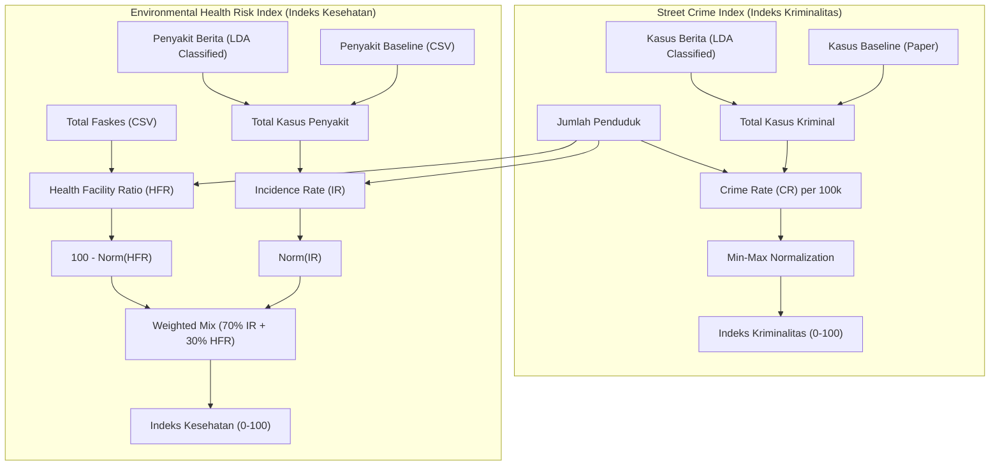
```mermaid
graph TD
    subgraph Kriminalitas ["Street Crime Index (Indeks Kriminalitas)"]
        A["Kasus Baseline (Paper)"] & B["Kasus Berita (LDA Classified)"] --> C["Total Kasus Kriminal"]
        C & D["Jumlah Penduduk"] --> E["Crime Rate (CR) per 100k"]
        E --> F["Min-Max Normalization"] --> G["Indeks Kriminalitas (0-100)"]
    end

    subgraph Kesehatan ["Environmental Health Risk Index (Indeks Kesehatan)"]
        H["Penyakit Baseline (CSV)"] & I["Penyakit Berita (LDA Classified)"] --> J["Total Kasus Penyakit"]
        J & D --> K["Incidence Rate (IR)"]
        L["Total Faskes (CSV)"] & D --> M["Health Facility Ratio (HFR)"]
        K --> N["Norm(IR)"]
        M --> O["100 - Norm(HFR)"]
        N & O --> P["Weighted Mix (70% IR + 30% HFR)"] --> Q["Indeks Kesehatan (0-100)"]
    end
```

### Indeks Kriminalitas (Street Crime Index)

```text
Crime Rate (CR) = (Total Kasus Baseline + Kasus dari Berita) / Penduduk × 100.000

Indeks Kriminalitas = (CR_kecamatan - CR_min) / (CR_max - CR_min) × 100
```

### Indeks Kesehatan (Environmental Health Risk Index)

```text
Incidence Rate (IR) = Total Kasus Penyakit / Penduduk × 100.000
Health Facility Ratio (HFR) = Total Faskes / Penduduk × 10.000

Indeks Kesehatan = 0.7 × Norm(IR) + 0.3 × (100 - Norm(HFR))
```

> **Catatan:** `Norm()` = Normalisasi Min-Max ke skala 0-100. Komponen HFR dibalik (100 - Norm) karena semakin banyak faskes = semakin rendah risikonya.

---

## Troubleshooting

| Masalah | Penyebab | Solusi |
|---------|----------|--------|
| `bitnami/spark:3.5: not found` | Docker image tidak tersedia di registry | Gunakan `bde2020/spark-master:3.3.0-hadoop3.3` |
| `ModuleNotFoundError: No module named 'numpy'` | Library numpy tidak ada di container Python | Tambahkan `numpy` ke pip install di shell script |
| `ModuleNotFoundError: No module named 'distutils'` | Python 3.12 menghapus distutils | Tambahkan `setuptools` ke pip install |
| `HDFS: Connection refused` | NameNode belum selesai inisialisasi | Tunggu ~60 detik setelah `docker compose up` |
| `Kafka: NoBrokersAvailable` | Kafka broker belum aktif | Tunggu ~30 detik atau restart container kafka |
| Container tidak mau nyala | Port conflict di host | Pastikan port 8020, 9870, 9092, 8080 tidak dipakai |

---

## Web UI Monitoring

Setelah Docker berjalan, Anda bisa memantau klaster melalui browser:

| Service | URL | Fungsi |
|---------|-----|--------|
| HDFS NameNode | [http://localhost:9870](http://localhost:9870) | File browser, storage info, DataNode status |
| YARN ResourceManager | [http://localhost:8088](http://localhost:8088) | Job monitoring, resource allocation |
| Spark Master | [http://localhost:8080](http://localhost:8080) | Worker status, running applications |
| NodeManager | [http://localhost:8042](http://localhost:8042) | Container logs, node health |

---

## Pilar Big Data yang Diimplementasikan

Proyek ini mengintegrasikan **6 pilar utama** materi kuliah Big Data:

| Pilar | Materi | Implementasi di KECAMATRAS |
|-------|--------|---------------------------|
| 1 | Pengantar Big Data | Memahami konsep 5V dan kebutuhan distributed computing |
| 2 | Apache Hadoop | HDFS sebagai distributed storage + YARN sebagai resource manager |
| 3 | Apache Spark | PySpark sebagai engine ETL dan kalkulasi indeks terdistribusi |
| 4 | Spark MLlib | LDA untuk topic modeling pada corpus berita berbahasa Indonesia |
| 5 | Apache Kafka | Event streaming real-time dari Google News RSS ke pipeline analitik |
| 6 | Data Lakehouse | Delta Lake sebagai format ACID-compliant di atas HDFS |

---

## Keunikan dan Inovasi Solusi

KECAMATRAS memiliki beberapa keunggulan kompetitif yang membedakannya dari solusi pemantauan spasial konvensional:

### Analisis Perbandingan Solusi (Competitor Analysis)

| Aspek Evaluasi | Portal Statistik Resmi (Pemkot) | Peta Kriminalitas Biasa (GIS) | Solusi KECAMATRAS (Lakehouse) |
|----------------|---------------------------------|-------------------------------|--------------------------------|
| **Sumber Data** | Hanya data internal instansi | Data historis kepolisian | Data historis + Streaming berita real-time |
| **Metode Update** | Tahunan / Bulanan (Statis) | Periodik Manual | Real-time Streaming (Kafka Event Broker) |
| **Teknik Analisis** | Statistik deskriptif basic | Klasifikasi spasial manual | Unsupervised ML (Spark LDA Topic Modeling) |
| **Responsivitas** | Lambat (menunggu rekap formal) | Menengah (menunggu input GIS) | Instan (1-2 menit setelah berita terbit) |
| **Integrasi Spasial** | Hanya tabel / grafik statis | Koordinat fix | Dynamic Geocoding (OSM) + Caching Browser |

---

## Relevansi Ekosistem Smart City dan Gemastik 2026

### Kontribusi terhadap Surabaya Smart City (Ekosistem Perkotaan)
KECAMATRAS dirancang sebagai sub-modul pendukung ekosistem **Surabaya Smart City (Smart Governance & Smart Environment)**. Dengan memetakan indeks risiko secara terdistribusi, sistem ini memberikan kontribusi nyata berupa:
* **Data-driven Safety Policy:** Membantu Satpol PP dan kepolisian memprioritaskan patroli malam di kecamatan dengan *Street Crime Index* tinggi.
* **Early Warning Health System:** Membantu Dinas Kesehatan mendeteksi dini lonjakan berita wabah (seperti Demam Berdarah/DBD) di wilayah padat penduduk sebelum laporan resmi puskesmas dirilis secara administratif.

### Rencana Partisipasi Gemastik 2026 (Divisi Kota Cerdas / Big Data)
Tim pengembang mengusulkan projek KECAMATRAS untuk berlaga di ajang **Gemastik 2026** pada divisi **Kota Cerdas (Smart City)** atau **Penambangan Data (Data Mining)** dengan fokus keunggulan pada:
* **Rancangan Proposal:** Proposal outline mencakup orkestrasi Big Data Lakehouse terdistribusi (HDFS, Spark, Kafka) yang mampu melakukan skalabilitas pemrosesan anomali spasial di kota-kota besar Indonesia selain Surabaya.
* **Nilai Inovasi:** Memanfaatkan analisis teks berita tidak terstruktur dari media massa untuk menyuplai koordinat peta secara dinamis, mengatasi ketiadaan API data kriminalitas publik di Indonesia.

---

## Tim Pengembang

<table align="center">
  <tr>
    <td align="center"><strong>Kelompok 1</strong></td>
  </tr>
  <tr>
    <td align="center">Departemen Teknologi Informasi — Institut Teknologi Sepuluh Nopember (ITS) Surabaya</td>
  </tr>
  <tr>
    <td align="center">Mata Kuliah Big Data — Semester 4 (2026)</td>
  </tr>
</table>

| No | Nama | NRP |
|:--:|------|:---:|
| 1 | Arya Bisma Putra Refman | `5027241036` |
| 2 | Kharisma Fahrun Nisa | `5027231086` |
| 3 | M. Hikari Reiziq Rakhmadinta | `5027241079` |
| 4 | Aras Rizky Ananta | `5027221053` |
| 5 | Ica Zika Hamizah | `5027241058` |

<p align="center">
  <em>Built using Apache Hadoop, Spark, Kafka, and Delta Lake</em>
</p>

---

## Lisensi

Proyek ini dilisensikan di bawah **[MIT License](LICENSE)**. Hak Cipta (c) 2026 Tim Kelompok 1.
