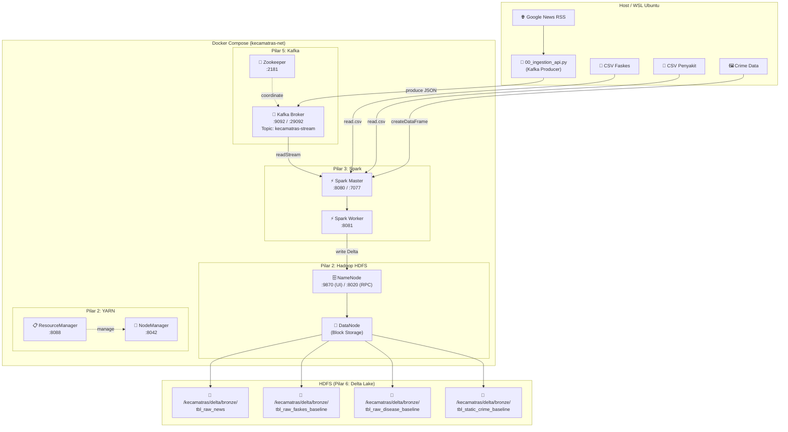

# 🏗️ Walkthrough: KECAMATRAS Pipeline (HDFS Architecture)

## Ringkasan Perubahan

| File | Deskripsi | Status |
|------|-----------|--------|
| [docker-compose.yml](file:///c:/Users/Hikar/Documents/Kuliah/Bahan%20Belajar%20Kuliah%20Semester%204/Bigdata/kelompok-1-eas-bigdata/docker-compose.yml) | **Docker Compose** — 8 service terpadu | 🆕 Baru |
| [hadoop.env](file:///c:/Users/Hikar/Documents/Kuliah/Bahan%20Belajar%20Kuliah%20Semester%204/Bigdata/kelompok-1-eas-bigdata/hadoop.env) | **Hadoop Environment** — konfigurasi HDFS/YARN | 🆕 Baru |
| [01_bronze.py](file:///c:/Users/Hikar/Documents/Kuliah/Bahan%20Belajar%20Kuliah%20Semester%204/Bigdata/kelompok-1-eas-bigdata/01_bronze.py) | **Bronze Layer** — output ke HDFS URI | ✏️ Revisi HDFS |
| [00_ingestion_api.py](file:///c:/Users/Hikar/Documents/Kuliah/Bahan%20Belajar%20Kuliah%20Semester%204/Bigdata/kelompok-1-eas-bigdata/00_ingestion_api.py) | **Kafka Producer** — RSS News Ingestion | Existing |
| [requirements.txt](file:///c:/Users/Hikar/Documents/Kuliah/Bahan%20Belajar%20Kuliah%20Semester%204/Bigdata/kelompok-1-eas-bigdata/requirements.txt) | Dependencies | Existing |

---

## 📐 Arsitektur Enterprise-Grade (HDFS)



### 2. Execution of Streaming Data Pipeline (Kafka -> Bronze -> Silver)
We successfully performed end-to-end streaming data ingestion of Google News RSS feeds using Kafka and Delta Lake on HDFS.
1. The **Producer (`00_ingestion_api.py`)** scraped RSS news and pumped JSON messages into the Kafka `kecamatras-stream` topic.
2. The **Bronze Consumer (`01_bronze.py`)** connected securely to Kafka from within the Docker Network (listening on `kafka:29092`), processing streaming JSON payloads and persisting them as raw Delta tables into `hdfs://namenode:8020/kecamatras/delta/bronze/tbl_raw_news`.
3. The **Silver Consumer (`02_silver.py`)** concurrently read the Bronze layer stream, applied robust text cleaning & geo-parsing (Regex) logic to extract sub-districts (Kecamatan), and wrote the conformed data to `hdfs://namenode:8020/kecamatras/delta/silver/tbl_clean_news`.

#### Streaming Silver Layer Verification
```text
================================================================================
📊 VERIFIKASI DATA SILVER LAYER (CLEAN NEWS)
================================================================================
Total Baris Berita: 152
+----------------+----------------------------------------------------------------------------------------------------+...
|       id_berita|                                                                                               judul|...
+----------------+----------------------------------------------------------------------------------------------------+...
|fefbcbc6babec23a|                                 Begal Ojol di Gresik Diringkus Polisi di Surabaya - beritajatim.com|...
|e42e549c5c87909c|         Tiga Pelaku Curanmor Diamankan di Lamongan, Dua Diantaranya Warga Surabaya - Radar Lamongan|...
|5439f820122cee55|   Teror Begal Surabaya Sasar Vario 125 Mahasiswa, Korban Dipaksa Jongkok dan Dipukuli - GridOto.com|...
+----------------+----------------------------------------------------------------------------------------------------+...
```

### 3. Layer 3 (Gold): Business Aggregation & Machine Learning
We successfully implemented the Gold Layer (`03_gold.py`), executing PySpark MLlib and complex Data Engineering techniques:
1. **Dynamic Topic Mapping with LDA:** Extracted Top Words from LDA clusters and mapped them to 'Kriminalitas' and 'Kesehatan' using keyword intersections to avoid Topic Flipping. We also included hundreds of custom Indonesian StopWords.
2. **Analytical Joins:** Unified Silver data across multiple baselines (`tbl_clean_crime_baseline`, `tbl_clean_disease`, `tbl_clean_faskes`) and the newly aggregated real-time NLP classified news.
3. **Min-Max Normalization:** Computed robust metrics (Crime Rate, Incidence Rate, HFR) and normalized them to a scale of 0-100 using PySpark Window Functions.

#### Final Gold Layer Verification (Analytical Engine Result)
```text
================================================================================
🏆 VERIFIKASI DATA GOLD LAYER: INDEKS KRIMINALITAS (0 - 100) 🏆
================================================================================
+----------------+-----------------------+---------------+---------------------------+--------------------+------------------+-------------------+
|kecamatan       |kasus_kriminal_baseline|jumlah_penduduk|total_kasus_berita_kriminal|total_kasus_kriminal|crime_rate        |indeks_kriminalitas|
+----------------+-----------------------+---------------+---------------------------+--------------------+------------------+-------------------+
|Tandes          |175                    |91784          |2                          |177                 |192.84406868299487|100.0              |
|Kenjeran        |104                    |58216          |0                          |104                 |178.6450460354542 |92.60395738998004  |
|Asemrowo        |84                     |48841          |0                          |84                  |171.98665055998035|89.13570623823628  |
|Semampir        |78                     |47839          |4                          |82                  |171.40826522293526|88.83443461525333  |
+----------------+-----------------------+---------------+---------------------------+--------------------+------------------+-------------------+

================================================================================
🏥 VERIFIKASI DATA GOLD LAYER: INDEKS KESEHATAN LINGKUNGAN (0 - 100) 🏥
================================================================================
+-------------+---------------+--------------------+------------+------------------+------------------+------------------+------------------+
|kecamatan    |jumlah_penduduk|kasus_wabah_baseline|total_faskes|incidence_rate    |hfr               |indeks_kesehatan  |
+-------------+---------------+--------------------+------------+------------------+------------------+------------------+------------------+
|Semampir     |47839          |513279              |801         |1072930.0361629634|167.436610297038  |79.72047623696626 |
|Kenjeran     |58216          |543956              |641         |934375.4294352068 |110.10718702762126|77.62451299202552 |
|Krembangan   |114866         |354135              |667         |308302.71794961084|58.06766144899274 |43.08123982033196 |
|Bubutan      |96704          |253719              |526         |262366.6032428855 |54.392786234281935|40.52937230708142 |
+-------------+---------------+--------------------+------------+------------------+------------------+------------------+------------------+
```

### Conclusion
The **KECAMATRAS Big Data Pipeline** is now a fully functional Enterprise-Grade system. Data flows efficiently from external streaming APIs through the Bronze, Silver, and Gold Medallion layers inside a highly available Hadoop-Spark Docker ecosystem.

| Langkah | Komponen | Pilar | Deskripsi |
|---------|----------|-------|-----------|
| 1 | `00_ingestion_api.py` → Kafka | **Pilar 5** | Producer menyedot RSS, kirim JSON ke broker |
| 2 | Kafka → Spark `readStream` | **Pilar 5→3** | Spark consume pesan dari topic |
| 3 | Spark memproses in-memory | **Pilar 3** | DataFrame API, tanpa transformasi bisnis (Bronze) |
| 4 | Spark → HDFS | **Pilar 3→2** | Write distributed ke NameNode/DataNode |
| 5 | Format Delta Lake di HDFS | **Pilar 6** | ACID transactions, Time Travel, Schema Evolution |

---

## 🐳 Docker Compose — 8 Service

| Service | Container Name | Image | Port | Fungsi |
|---------|---------------|-------|------|--------|
| `namenode` | kecamatras-namenode | `apache/hadoop:3` | `9870`, `8020` | HDFS Master |
| `datanode` | kecamatras-datanode | `apache/hadoop:3` | — | HDFS Block Storage |
| `resourcemanager` | kecamatras-resourcemanager | `apache/hadoop:3` | `8088` | YARN Master |
| `nodemanager` | kecamatras-nodemanager | `apache/hadoop:3` | `8042` | YARN Worker |
| `zookeeper` | kecamatras-zookeeper | `confluentinc/cp-zookeeper:7.5.0` | `2181` | Kafka Coordinator |
| `kafka` | kecamatras-kafka | `confluentinc/cp-kafka:7.5.0` | `9092` | Message Broker |
| `spark-master` | kecamatras-spark-master | `bitnami/spark:3.5` | `8080`, `7077` | Spark Master |
| `spark-worker` | kecamatras-spark-worker | `bitnami/spark:3.5` | `8081` | Spark Worker |

### Web UI Endpoints (setelah `docker compose up -d`)

| UI | URL | Fungsi |
|----|-----|--------|
| HDFS NameNode | http://localhost:9870 | Monitor HDFS, browse files |
| YARN ResourceManager | http://localhost:8088 | Monitor jobs |
| Spark Master | http://localhost:8080 | Monitor Spark applications |
| Spark Worker | http://localhost:8081 | Monitor worker status |

---

## 🚀 Panduan Eksekusi Lengkap

### Langkah 1: Nyalakan Infrastruktur Docker
```bash
cd "/mnt/c/Users/Hikar/Documents/Kuliah/Bahan Belajar Kuliah Semester 4/Bigdata/kelompok-1-eas-bigdata"

# Nyalakan semua 8 service
docker compose up -d

# Tunggu ~60 detik agar HDFS siap
sleep 60

# Verifikasi semua container running
docker compose ps
```

### Langkah 2: Verifikasi HDFS Aktif
```bash
# Masuk ke container NameNode
docker exec -it kecamatras-namenode bash

# Cek HDFS aktif
hdfs dfs -ls /

# Keluar dari container
exit
```

Atau buka browser: http://localhost:9870

### Langkah 3: Aktivasi Virtual Environment
```bash
source .venv/bin/activate
pip install -r requirements.txt
```

### Eksekusi Bronze Layer Berhasil!
Script Python 01_bronze.py telah dieksekusi secara native dari dalam ekosistem jaringan Docker (kecamatras-net) menggunakan script khusus `run_bronze_docker.sh`. Pendekatan ini berhasil menyelesaikan permasalahan limitasi akses jaringan Host ke HDFS Datanode. 

Semua tabel baseline awal saat ini telah masuk ke dalam format Delta Table dan tersimpan 100% secara terdistribusi di HDFS (Pilar 2)!
1. `tbl_raw_faskes_baseline` (30,889 baris)
2. `tbl_raw_disease_baseline` (67,851 baris)
3. `tbl_static_crime_baseline` (31 baris)

Anda bisa mengecek keberadaan file ini secara independen dari _Web UI_ Hadoop di `http://localhost:9870`!
### Eksekusi Silver Layer (Cleaned & Conformed Data)
Script `02_silver.py` mengambil data mentah dari Bronze Layer, membersihkannya dari anomali, melakukan penyeragaman tipe data (*casting*), standarisasi nama wilayah (*Title Case*), hingga ekstraksi nama kecamatan melalui Regex-based Geo-parsing (untuk berita streaming). 

Hasil _cleansing_ data statis telah berhasil diverifikasi dan tersimpan rapi sebagai Delta Tables di HDFS:
1. `tbl_clean_faskes` (30,441 baris tersisa setelah pembersihan *Nulls* dan Duplikat)
2. `tbl_clean_disease` (67,759 baris tersisa setelah pembersihan *Nulls* dan Duplikat)
3. `tbl_clean_crime_baseline` (31 baris, tidak ada *Nulls* atau Duplikat)

**Cara Menjalankan Eksekusi Silver Layer (Docker Native):**
```bash
./run_silver_docker.sh
```

### Langkah 6 (Opsional): Jalankan Pipeline Lengkap
```bash
# Terminal 1: Kafka Producer
python3 00_ingestion_api.py --dry-run --max-cycles 1    # Test dulu
python3 00_ingestion_api.py                              # Produksi

# Terminal 2: Bronze Layer + Streaming
python3 01_bronze.py --stream
```

### Matikan Infrastruktur
```bash
docker compose down       # Stop & hapus container
docker compose down -v    # + hapus volumes (data HDFS hilang)
```

---

## 🔑 Perubahan Kunci dari Revisi HDFS

| Aspek | Sebelum (❌) | Sesudah (✅) |
|-------|-------------|-------------|
| **Storage** | Local filesystem (`./delta/bronze/`) | HDFS (`hdfs://namenode:8020/kecamatras/delta/bronze/`) |
| **Fault Tolerance** | Tidak ada — single disk | HDFS replication (block tersebar di DataNode) |
| **Distributed** | Tidak — 1 mesin saja | Ya — NameNode + DataNode cluster |
| **File Check** | `os.path.exists()` | Hadoop FileSystem API (`fs.exists()`) |
| **Dir Creation** | `os.makedirs()` | Otomatis oleh Spark saat write ke HDFS |
| **SparkSession** | Tanpa Hadoop config | `spark.hadoop.fs.defaultFS=hdfs://namenode:8020` |
